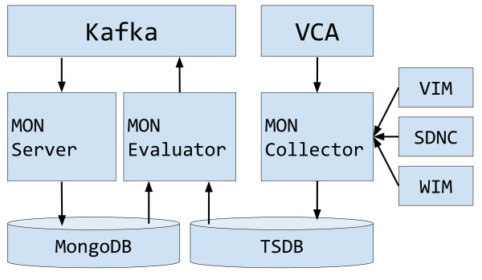
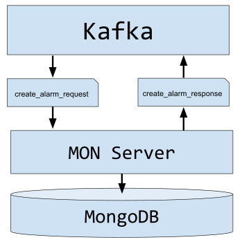
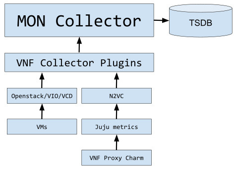
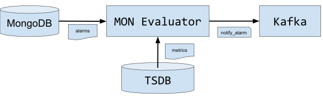

<!--
This file is part of OSM Monitoring module
All Rights Reserved to Whitestack, LLC

Licensed under the Apache License, Version 2.0 (the "License"); you may
not use this file except in compliance with the License. You may obtain
a copy of the License at

        http://www.apache.org/licenses/LICENSE-2.0

Unless required by applicable law or agreed to in writing, software
distributed under the License is distributed on an "AS IS" BASIS, WITHOUT
WARRANTIES OR CONDITIONS OF ANY KIND, either express or implied. See the
License for the specific language governing permissions and limitations
under the License.

For those usages not covered by the Apache License, Version 2.0 please
contact: bdiaz@whitestack.com or glavado@whitestack.com
-->
# Monitoring module (MON)

## Summary

MON accomplishes the following tasks:

* Collects VDU metrics exposed by the VIM.
* Collects VNF metrics exposed by the VNF via Juju charms.
* Collects infrastructure metrics of external components, such as VIMs, WIMs and SDN controllers.
* Stores metrics in a TSDB.
* Manages and evaluates alarms related to VNF/VDU metrics.

## Overview

MON has the following components:

* MON Server: Handles alarms CRUD operations, through messages in the Kafka bus.
* MON Collector: Collects VNF related metrics from VIMs and VCA and infrastructure metrics from external components, and then exports them to a Prometheus TSDB. It uses a plugin model both for collectors and for backends.
* MON Evaluator: Evaluates alarms and sends notifications through the Kafka bus when they trigger.

## MON Server

MON Server subscribes to the message bus and waits for the following messages:

* topic: alarm_request - key: create_alarm_request
* topic: alarm_request - key: delete_alarm_request

It performs the corresponding action and sends a response through a unique topic made of 'alarm_response_' plus a correlation_id, which is a field contained in the request message.

Alarms are stored in MON database in the OSM MongoDB engine.

## MON Collector

MON Collector handles two different types of metrics:

* VNF related metrics: Provided by the VIM (eg. cpu utilization of a VDU) or directly from the VNF itself (eg. number of users connected).
* Infrastructure metrics: Correspond to metrics regarding external components such as VIMs (eg. status, hypervisor capacity, etc), WIMs and SDN controllers.

The module uses a plugin model to do the metric collection. In every collection cycle, it iterates over the running VNFs (VNFRs) as obtains the declared metrics in their VNFD. If it is a VIM provided metric (nfvi_metric), it selects the corresponding VIM plugin for doing that collection. In the case of an application metric (defined using proxy charms and the juju metrics framework), it is done through the Juju plugin.

Similar situation happens for external components. The module iterates over the registered VIMs, SDNCs and WIMs, and does collection of the status and other metrics through the corresponding plugin (eg. OpenStack, ONOS).

## MON Evaluator

MON Evaluator iterates over the alarms stored in the system and evaluates the corresponding metric by querying the TSDB against the alarm defined threshold. Then it published to the message bus a message containing the alarm info and the corresponding status.

An alarm can have three status:  

* ok: The metric has not crossed the threshold.
* alarm: The metric crossed the threshold.
* insufficient-data: There is no metric data in the TSDB.
